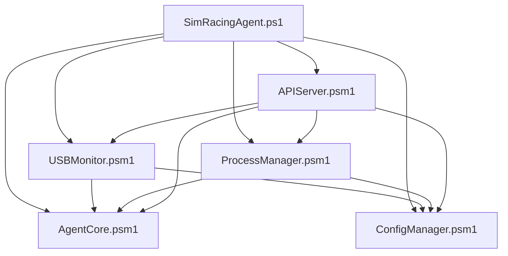

# USB Monitor Project Structure

## Overview
This project follows a clean, modular architecture separating agent implementation from future server components while maintaining shared resources.

## Directory Structure

```
USBMonitor/
├── README.md                           # Project overview and getting started
├── agent/                              # Windows Agent Implementation
│   ├── SimRacingAgent.ps1               # Main agent executable
│   ├── README.md                       # Agent-specific documentation
│   ├── src/                            # Source code
│   │   ├── core/                       # Core functionality
│   │   │   ├── AgentCore.psm1         # Instance management, logging
│   │   │   └── ConfigManager.psm1     # Configuration management
│   │   ├── modules/                    # Monitoring modules
│   │   │   ├── USBMonitor.psm1        # USB device monitoring
│   │   │   └── ProcessManager.psm1    # Process lifecycle management
│   │   └── api/                        # REST API layer
│   │       └── APIServer.psm1         # HTTP server with health checks
│   ├── tests/                          # Testing
│   │   ├── Test-AgentCore.ps1         # Core functionality tests
│   │   ├── Test-ConfigManager.ps1     # Configuration tests
│   │   ├── Test-USBMonitor.ps1        # USB monitoring tests
│   │   ├── Test-ProcessManager.ps1    # Process management tests
│   │   └── Test-APIServer.ps1         # API server tests
│   ├── docs/                           # Agent documentation
│   │   ├── Legacy-README.md           # Original documentation
│   │   └── [other agent docs]         # Additional documentation
│   └── tools/                          # Installation and utilities
│       ├── Install-Agent.ps1          # Agent installer
│       └── Uninstall-Agent.ps1        # Agent uninstaller
├── server/                             # Future server components
│   ├── README.md                       # Server planning documentation
│   └── src/                            # Future server implementation
└── shared/                             # Shared resources
    ├── config/                         # Common configuration
    └── docs/                           # Project-wide documentation
        └── Health-Check-System.md # Health check documentation
```

## Design Principles

### 1. Separation of Concerns
- **Agent**: Lightweight Windows monitoring client
- **Server**: Future centralized management platform
- **Shared**: Common utilities and documentation

### 2. Modular Architecture
- **Core**: Essential functionality (agent lifecycle, configuration)
- **Modules**: Specific monitoring capabilities (USB, processes)
- **API**: External interface layer

### 3. Clean Dependencies
- Core modules have minimal dependencies
- Monitoring modules depend on core
- API layer orchestrates all components
- Clear import hierarchy prevents circular dependencies

### 4. Testability
- Each module has corresponding test file
- Tests are isolated in dedicated directory
- Clear test naming convention

### 5. Documentation
- Module-specific docs stay with implementation
- Project-wide concepts in shared docs
- README files at each major level

## Benefits of This Structure

### 🎯 **Developer Experience**
- **Easy Navigation**: Logical grouping of related functionality
- **Clear Boundaries**: Obvious separation between different concerns
- **Scalability**: Easy to add new modules or extend existing ones

### 📦 **Maintainability**
- **Isolated Changes**: Modifications stay within relevant boundaries
- **Clear Dependencies**: Import paths show architectural relationships
- **Version Control**: Changes grouped by functional area

### 🚀 **Future Growth**
- **Server Ready**: Clear path for server implementation
- **Module Expansion**: Easy to add new monitoring capabilities
- **Cross-Platform**: Structure supports future multi-platform components

## Module Relationships



## Getting Started with New Structure

### 1. Agent Development
```powershell
cd agent
.\SimRacingAgent.ps1
```

### 2. Adding New Modules
1. Create module in appropriate `src/` subdirectory
2. Add corresponding test file in `tests/`
3. Update main agent script imports
4. Document in module-specific README if needed

### 3. Testing
```powershell
cd agent/tests
# Run specific test files
```

This structure provides a solid foundation for both current agent functionality and future server-side development while maintaining clean, readable, and maintainable code organization.
