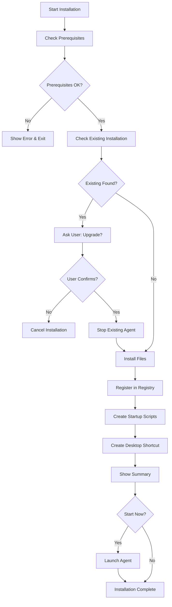
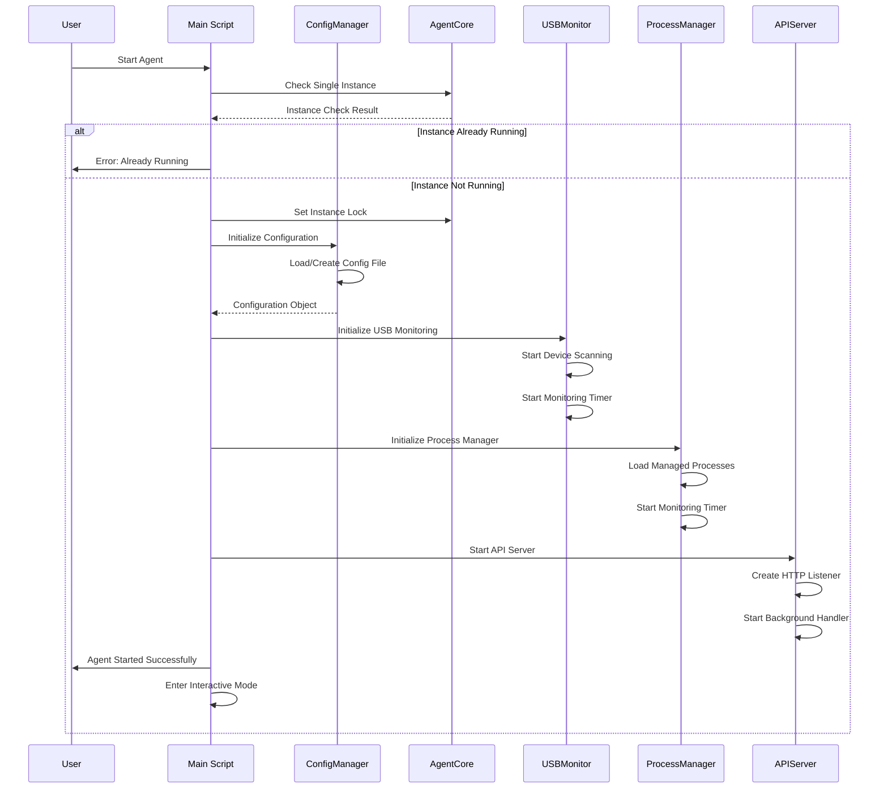
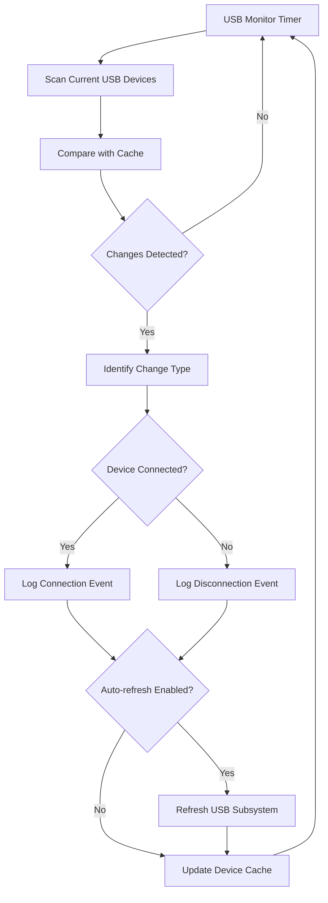
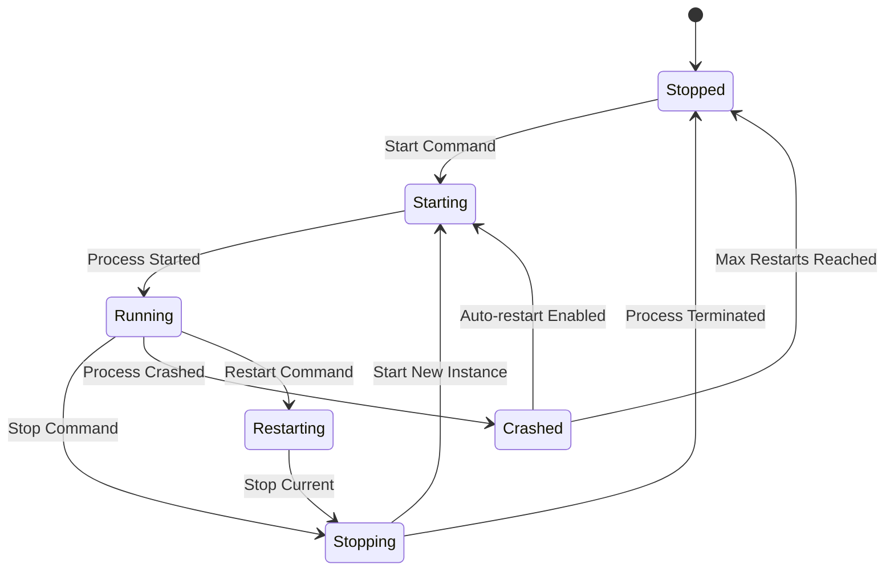

# Windows Agent Documentation

## Overview

The Windows Agent is a lightweight, PowerShell-based monitoring and control system designed for Windows 11 environments. It provides USB device monitoring, process management, and a REST API for remote control.

## Architecture Overview

```mermaid
graph TB
    subgraph "Windows Agent Architecture"
        A[SimRacingAgent.ps1<br/>Main Entry Point] --> B[AgentCore Module]
        A --> C[ConfigManager Module]
        A --> D[USBMonitor Module]
        A --> E[ProcessManager Module]
        A --> F[APIServer Module]
        
        B --> G[Instance Management]
        B --> H[Logging System]
        B --> I[Version Control]
        
        C --> J[JSON Configuration]
        C --> K[Data Directory]
        
        D --> L[USB Device Detection]
        D --> M[Device Control]
        D --> N[Event Logging]
        
        E --> O[Process Control]
        E --> P[Auto-restart]
        E --> Q[Status Monitoring]
        
        F --> R[REST API Endpoints]
        F --> S[Network Security]
    end
    
    subgraph "External Interfaces"
        T[Configuration UI] --> F
        U[Remote Applications] --> F
        V[Windows USB Subsystem] --> D
        W[Windows Processes] --> E
        X[File System] --> C
        Y[Windows Registry] --> B
    end
```



## System Components

### 1. Main Agent (SimRacingAgent.ps1)

The main entry point that orchestrates all modules and provides different operational modes.

**Modes:**
- **Terminal Mode**: Interactive console interface
- **Service Mode**: Background service (Future implementation)
- **Install Mode**: Runs the installer
- **Uninstall Mode**: Runs the uninstaller

### 2. Core Modules

#### AgentCore.psm1
- Single instance enforcement
- Administrator privilege checking
- Logging infrastructure
- Version management
- Network connectivity testing

#### ConfigManager.psm1
- JSON-based configuration management
- Default configuration generation
- Configuration validation and merging
- Export/import functionality
- Runtime configuration updates

#### USBMonitor.psm1
- Real-time USB device monitoring
- Device enable/disable functionality
- USB subsystem refresh capabilities
- Event logging and statistics
- Configurable monitoring intervals

#### ProcessManager.psm1
- Software process lifecycle management
- Auto-restart functionality
- Process status monitoring
- Configurable restart policies
- Process health checking

#### APIServer.psm1
- HTTP REST API server
- JSON request/response handling
- Network security (intranet-only)
- CORS support
- Error handling and logging

## Installation Flow



## Agent Startup Flow



## USB Monitoring Flow



## Process Management Flow



## API Endpoints

### Core Endpoints

#### GET /
Returns basic API information and available endpoints.

#### GET /status
Returns comprehensive agent status including:
- Agent version and uptime
- USB monitoring statistics
- Process management status
- API server statistics

### USB Management

#### GET /usb
Returns list of all detected USB devices (cached data).

#### POST /usb
Performs USB-related actions:
- `refresh`: Refresh USB subsystem

#### POST /usb/{deviceId}
Controls specific USB device:
- `enable`: Enable USB device
- `disable`: Disable USB device

#### PUT /healthcheck/usb (Alias: /health/usb)
**NEW**: Triggers fresh USB device scan and returns comprehensive health data.
Recommended polling interval: 10 seconds (configurable via `USB.HealthCheckInterval`).

### Process Management

#### GET /processes
Returns list of all managed processes (cached data).

#### POST /processes
Add new managed process with configuration.

#### GET /processes/{processName}
Get status of specific managed process.

#### POST /processes/{processName}
Control specific process:
- `start`: Start the process
- `stop`: Stop the process
- `restart`: Restart the process

#### DELETE /processes/{processName}
Remove process from management.

#### PUT /healthcheck/processes (Alias: /health/processes)
**NEW**: Triggers fresh process status scan and returns comprehensive health data.
Recommended polling interval: 60 seconds (configurable via `ProcessManager.HealthCheckInterval`).

### Health Check System

#### GET /healthcheck (Alias: /health)
Returns health check configuration and available endpoints.

#### PUT /healthcheck (Alias: /health)
**NEW**: Triggers comprehensive health check across all components (USB + Processes).
Returns detailed status including changes since last check.

**Health Check Benefits:**
- **Efficient**: Only scans when requested instead of continuous monitoring
- **Fresh Data**: Always returns current state, not cached data  
- **Change Detection**: Reports what changed since last health check
- **Configurable**: Polling intervals adjustable at runtime
- **Resource Friendly**: Agent idles between health checks

### Configuration

#### GET /config
Returns current agent configuration (sanitized).

#### PUT /config
Update specific configuration values.

## Configuration Structure

```json
{
  "Version": "1.0.0",
  "Agent": {
    "Name": "SimRacingAgent",
    "Description": "Lightweight Windows monitoring and control agent",
    "InstallPath": "C:\\Program Files\\SimRacingAgent",
    "DataPath": "C:\\Users\\{USER}\\AppData\\Local\\SimRacingAgent"
  },
  "USB": {
    "Enabled": true,
    "MonitoringInterval": 5,
    "LogDeviceChanges": true,
    "AutoRefreshOnChange": false
  },
  "ProcessManager": {
    "Enabled": true,
    "ManagedProcesses": [],
    "MonitoringInterval": 10
  },
  "API": {
    "Enabled": true,
    "Port": 8080,
    "AllowedHosts": ["127.0.0.1", "localhost"],
    "EnableAuthentication": false
  },
  "Logging": {
    "Level": "Info",
    "EnableFileLogging": true,
    "LogFilePath": "...\\SimRacingAgent\\Logs\\agent.log",
    "MaxLogSizeMB": 50,
    "MaxLogFiles": 5
  },
  "Network": {
    "IntranetOnly": true,
    "AllowedNetworks": ["192.168.0.0/16", "10.0.0.0/8", "172.16.0.0/12"]
  }
}
```

## Security Considerations

### Network Security
- **Intranet Only**: API server only accepts connections from private network ranges
- **No External Access**: Blocks connections from public IP addresses
- **Localhost Binding**: HTTP listener binds only to localhost by default

### Authentication
- **Personal Use**: No authentication implemented as per requirements
- **Future Enhancement**: MQTT interface can add authentication when implemented

### Privileges
- **Standard User**: Agent runs with standard user privileges
- **Administrator Required**: Only for USB device enable/disable operations
- **Installation**: Administrator privileges required for installation only

## File Structure

```
SimRacingAgent/
├── SimRacingAgent.ps1              # Main entry point
├── src/
│   ├── Modules/
│   │   ├── AgentCore.psm1        # Core functionality
│   │   ├── ConfigManager.psm1    # Configuration management
│   │   ├── USBMonitor.psm1       # USB device monitoring
│   │   ├── ProcessManager.psm1   # Process management
│   │   └── APIServer.psm1        # REST API server
│   └── Config/
│       └── agent.json            # Default configuration
├── installer/
│   ├── Install-Agent.ps1         # Installation script
│   └── Uninstall-Agent.ps1       # Uninstallation script
├── tests/
│   ├── Test-AgentCore.ps1        # Core module tests
│   ├── Test-ConfigManager.ps1    # Config manager tests
│   └── Run-AllTests.ps1          # Test runner
└── docs/
    └── README.md                 # This documentation
```

## Error Handling

### Graceful Degradation
- **USB Monitoring**: Continues if WMI queries fail
- **Process Management**: Isolated process failures don't affect others
- **API Server**: Request failures don't crash the server
- **Configuration**: Falls back to defaults if config file is corrupted

### Logging
- **Multi-level Logging**: Debug, Info, Warning, Error levels
- **File and Console**: Dual output for better debugging
- **Log Rotation**: Automatic cleanup of old log files
- **Component Tagging**: Each log entry tagged with source component

## Performance Characteristics

### Resource Usage
- **Memory**: ~10-20MB typical usage
- **CPU**: <1% during normal monitoring
- **Disk**: Minimal reads/writes for logging and config
- **Network**: Only localhost HTTP traffic

### Monitoring Intervals
- **USB Devices**: 5-second default interval (configurable)
- **Processes**: 10-second default interval (configurable)
- **Timers**: Efficient .NET Timer objects, not polling loops

## Testing Framework

### Unit Tests
- **AgentCore**: Instance management, logging, version checking
- **ConfigManager**: Configuration operations, file handling
- **USBMonitor**: Device detection, event handling
- **ProcessManager**: Process control, auto-restart logic

### Integration Tests
- **End-to-End**: Full agent startup and shutdown
- **API Testing**: REST endpoint functionality
- **Multi-component**: Module interaction testing

### Test Runner
- **Automated Execution**: Run all tests with single command
- **HTML Reports**: Detailed test results and coverage
- **CI/CD Ready**: Exit codes for automated pipelines

## Future Enhancements

### Service Mode
- **Windows Service**: Convert to proper Windows service
- **Service Control**: Start/stop via Windows Services Manager
- **Auto-start**: Start with Windows boot
- **Background Operation**: No console window required

### MQTT Interface
- **Message Broker**: Publish status to MQTT broker
- **Remote Control**: Receive commands via MQTT
- **Event Streaming**: Real-time USB and process events
- **Multiple Agents**: Orchestrate multiple agent instances

### Advanced Features
- **Web Dashboard**: HTML/JavaScript configuration interface
- **Remote Logging**: Centralized log collection
- **Health Monitoring**: System resource monitoring
- **Plugin System**: Extensible module architecture

## Troubleshooting

### Common Issues

#### Agent Won't Start
1. **Check Privileges**: Ensure PowerShell execution policy allows scripts
2. **Port Conflicts**: Verify port 8080 is not in use
3. **Lock File**: Remove stale lock file from `%TEMP%\SimRacingAgent.lock`

#### USB Monitoring Not Working
1. **WMI Service**: Ensure Windows Management Instrumentation service is running
2. **Permissions**: Check user has access to WMI queries
3. **Device Drivers**: Verify USB devices have proper drivers installed

#### Process Management Issues
1. **Executable Paths**: Verify managed process paths are correct
2. **Working Directory**: Ensure working directories exist and are accessible
3. **Permissions**: Check user can start/stop target processes

#### API Not Accessible
1. **Firewall**: Check Windows Firewall allows localhost connections
2. **Network Interface**: Verify localhost (127.0.0.1) is accessible
3. **Service Status**: Confirm API server started successfully

### Log Analysis
- **Log Location**: Check `%LOCALAPPDATA%\SimRacingAgent\Logs\agent.log`
- **Debug Mode**: Set logging level to "Debug" for detailed information
- **Component Filtering**: Look for specific component tags in log entries

### Support Information
- **PowerShell Version**: Requires PowerShell 5.1 or higher
- **Windows Version**: Optimized for Windows 10/11
- **Architecture**: Supports x86 and x64 architectures
- **Dependencies**: No external dependencies, uses built-in Windows components

---

This documentation provides comprehensive information for installation, configuration, operation, and troubleshooting of the Windows Agent system.